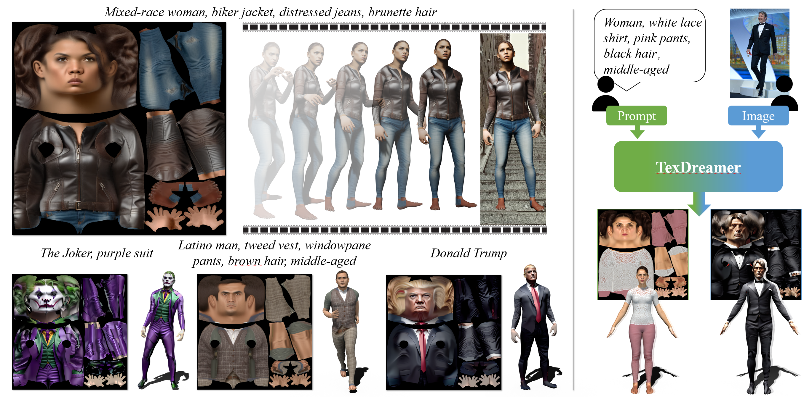
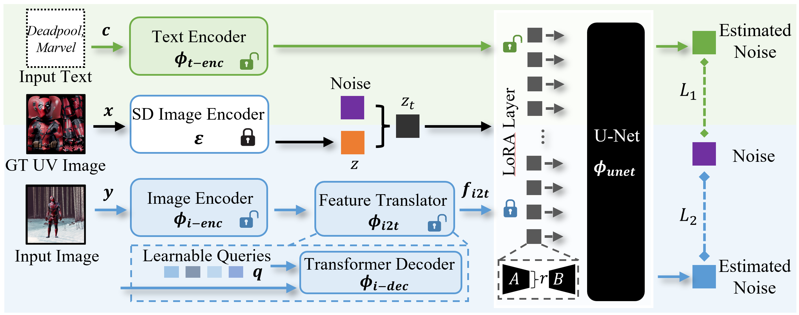

# TexDreamer: Towards Zero-Shot High-Fidelity 3D Human Texture Generation [ECCV 2024] 


### [Project Page](https://ggxxii.github.io/texdreamer/) | [Paper (ArXiv)](https://arxiv.org/abs/2403.12906)


[Yufei Liu](https://ggxxii.github.io/)<sup>1</sup>,
Junwei Zhu <sup>2</sup>,
[Junshu Tang](https://junshutang.github.io/)<sup>3</sup>,
Shijie Zhang <sup>4</sup>,
[Jiangning Zhang](https://zhangzjn.github.io/)<sup>2</sup>,
Weijian Cao<sup>2</sup>,
Chengjie Wang<sup>2</sup>,
Yunsheng Wu<sup>2</sup>,
Dongjin Huang<sup>1*</sup><br>


<sup>1</sup>Shanghai University, <sup>2</sup>Tencent Youtu Lab, <sup>3</sup>Shanghai Jiao Tong University <sup>4</sup> Fudan University

## Updates
<!-- [09/2022] :fire::fire::fire:**If you are looking for a higher-quality 3D human generation method, go checkout our new work [EVA3D](https://hongfz16.github.io/projects/EVA3D.html)!**:fire::fire::fire:

[09/2022] :fire::fire::fire:**If you are looking for a higher-quality text2motion method, go checkout our new work [MotionDiffuse](https://mingyuan-zhang.github.io/projects/MotionDiffuse.html)!**:fire::fire::fire:

[07/2022] Code release for motion generation part!

[05/2022] [Paper](https://arxiv.org/abs/2205.08535) uploaded to arXiv. [](https://arxiv.org/abs/2205.08535)

[05/2022] Add a [Colab Demo](https://colab.research.google.com/drive/1dfaecX7xF3nP6fyXc8XBljV5QY1lc1TR?usp=sharing) for avatar generation! [](https://colab.research.google.com/drive/1dfaecX7xF3nP6fyXc8XBljV5QY1lc1TR?usp=sharing)

[05/2022] Support converting the generated avatar to the **animatable FBX format**! Go checkout [how to use the FBX models](#use-generated-fbx-models). Or checkout the [instructions](./Avatar2FBX/README.md) for the conversion codes.

[05/2022] Code release for avatar generation part! -->

[07/2024] TexDreamer is accepted to ECCV 2024!


<!-- ## :star2: Pipeline


## :star2: Method
 -->

## Installation

We recommend using anaconda to manage the python environment. The setup commands below are provided for your reference.

```bash
git clone https://github.com/ggxxii/texdreamer.git
cd texdreamer
conda create -n texdreamer python=3.8
conda activate texdreamer
conda install pytorch==2.0.0 torchvision==0.15.0 torchaudio==2.0.0 pytorch-cuda=11.7 -c pytorch -c nvidia
pip install -r requirements.txt
```
Please also install xformers following: https://github.com/facebookresearch/xformers.git instructions.


## Data Preparation

### Download TexDreamer Trained models
You can find our model .zip from [Huggingface](https://huggingface.co/ggxxii/TexDreamer)
Put the downloaded models in the folder `texdreamer_u128_t16_origin`. The folder structure should look like

```
./
├── ...
└── texdreamer_u128_t16_origin/
    ├── i2t
        ├── i2t_decoder.pth
        └── SMPL_NEUTRAL.pkl
    ├── i2uv
        ├── vision_encoder
            ├──config.json
            └──pytorch_model.bin
        └── i2t_decoder.pth
    ├── text_encoder
        ├── adapter_config.json
        └── adapter_model.bin
    ├── unet
        ├── adapter_config.json
        └── adapter_model.bin
```

## Generate Human Texture from Text

### From input .txt file

We provide a txt file with 6 sample prompts. You can find it in `data/sample_prompts.txt`. And the sample generation results are in `output/t2uv`.

```bash
python infer_t2uv.py --lora_path texdreamer_u128_t16_origin --save_path output/t2uv --test_list data/sample_prompts.txt
```
Since we load stabilityai/stable-diffusion-2-1 from local files, you may need first download it and change 'cache_dir' in function 'get_lora_sd_pipeline'.

## Generate Human Texture from Image

### From input image folder

We provide some sample images from [Market-1501](https://zheng-lab.cecs.anu.edu.au/Project/project_reid.html) dataset. You can find it in `data/input`. And the sample generation results are in `output/i2uv`. 

Of course you can also use your own images.

```bash
python infer_i2uv.py --lora_path texdreamer_u128_t16_origin --save_path output/i2uv --test_folder data/input
```


## Citation
If you find our work useful for your research, please consider citing the paper:
```
@misc{liu2024texdreamer,
      title={TexDreamer: Towards Zero-Shot High-Fidelity 3D Human Texture Generation}, 
      author={Yufei Liu and Junwei Zhu and Junshu Tang and Shijie Zhang and Jiangning Zhang and Weijian Cao and Chengjie Wang and Yunsheng Wu and Dongjin Huang},
      year={2024},
      eprint={2403.12906},
      archivePrefix={arXiv},
      primaryClass={cs.CV}}
```